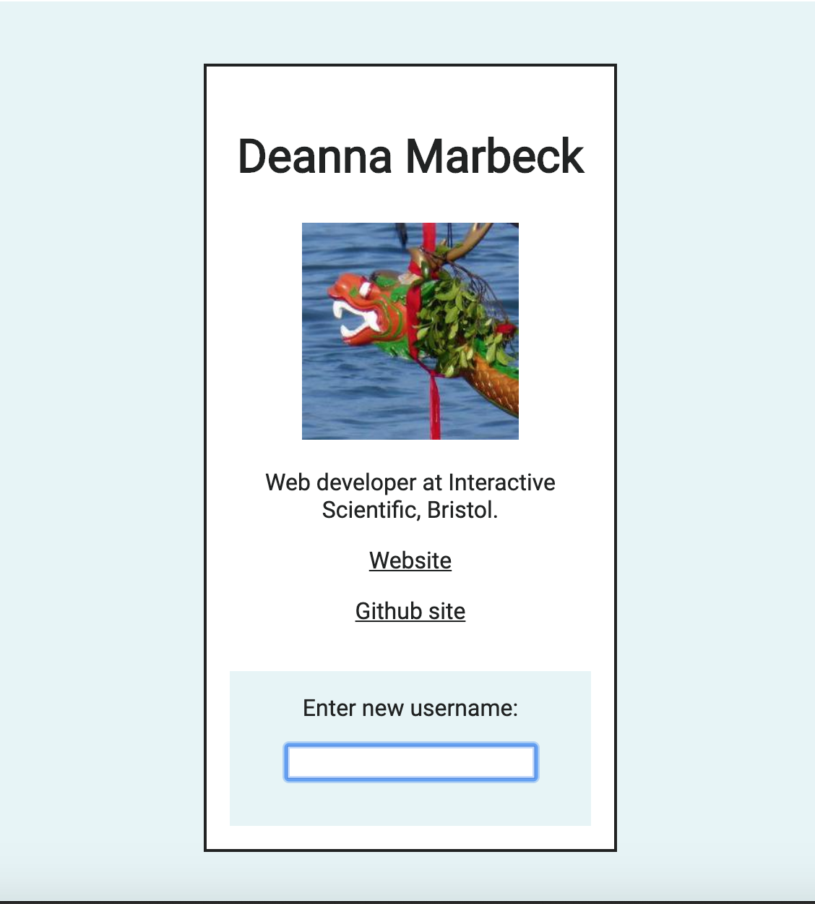

# React demo project

This is a minimalist React proof-of-concept demonstrating fetching data from an API and displaying a card.

It fetches data for a given GitHub username from the GitHub API and displays information from the profile.

It uses the following:
* React
* Redux
* Styled components
* Redux Thunk

## Screenshot

### Future enhancements:
* Error handling
* Styling upgrade
* Tests

This project was bootstrapped with [Create React App](https://github.com/facebook/create-react-app).

## Available Scripts

In the project directory, you can run:

### `npm start`

Runs the app in the development mode. 
Open [http://localhost:3000](http://localhost:3000) to view it in the browser.

